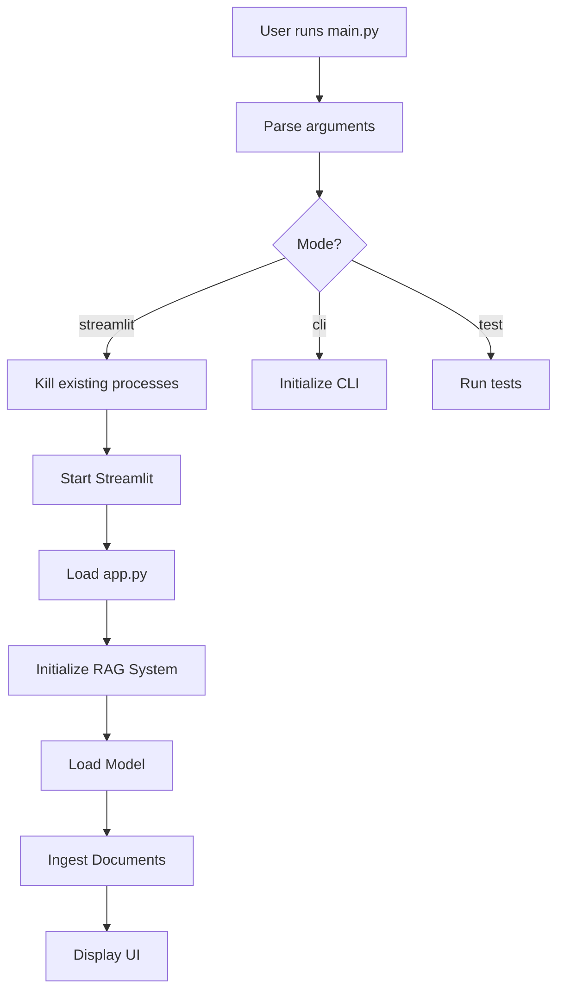

# 🔍 Code Walkthrough

A comprehensive guide to understanding the LightRAG with UI codebase architecture, components, and implementation details.

> **🏗️ Modular Architecture**: The system has been refactored into clean, single-responsibility modules for better maintainability and scalability.

## 📋 Table of Contents

1. [Project Architecture](#project-architecture)
2. [Core Components](#core-components)
3. [File Structure Analysis](#file-structure-analysis)
4. [Data Flow](#data-flow)
5. [Configuration System](#configuration-system)
6. [Error Handling](#error-handling)
7. [Dependencies](#dependencies)
8. [Development Guidelines](#development-guidelines)

---

## 🏗️ Project Architecture

### **High-Level Overview**

The LightRAG with UI project follows a modular, layered architecture:

```
┌──────────────────────────────────────────────────────────────┐
│                    Presentation Layer                        │
│  ┌─────────────────┐  ┌─────────────────┐  ┌──────────────┐  │
│  │   Streamlit UI  │  │   CLI Interface │  │   Test Mode  │  │
│  │     (app.py)    │  │    (main.py)    │  │   (main.py)  │  │
│  └─────────────────┘  └─────────────────┘  └──────────────┘  │
└──────────────────────────────────────────────────────────────┘
┌──────────────────────────────────────────────────────────────┐
│                    Business Logic Layer                      │
│  ┌─────────────────┐  ┌─────────────────┐  ┌──────────────┐  │
│  │   RAG System    │  │  LLM Provider   │  │  Document    │  │
│  │ (rag_system.py) │  │(llm_provider.py)│  │  Ingestion   │  │
│  └─────────────────┘  └─────────────────┘  └──────────────┘  │
└──────────────────────────────────────────────────────────────┘
┌──────────────────────────────────────────────────────────────┐
│                    Configuration Layer                       │
│  ┌─────────────────┐  ┌─────────────────┐  ┌──────────────┐  │
│  │   Settings      │  │  Environment    │  │   Setup      │  │
│  │ (settings.py)   │  │   (.env)        │  │  Scripts     │  │
│  └─────────────────┘  └─────────────────┘  └──────────────┘  │
└──────────────────────────────────────────────────────────────┘
┌─────────────────────────────────────────────────────────────┐
│                    External Services                        │
│  ┌─────────────────┐  ┌─────────────────┐  ┌──────────────┐ │
│  │     Ollama      │  │   File System   │  │   Logging    │ │
│  │   (LLM API)     │  │   (Documents)   │  │   System     │ │
│  └─────────────────┘  └─────────────────┘  └──────────────┘ │
└─────────────────────────────────────────────────────────────┘
```

### **Design Principles**

1. **Separation of Concerns**: Each module has a single responsibility
2. **Dependency Injection**: Components are loosely coupled
3. **Configuration-Driven**: Behavior controlled via environment variables
4. **Error Resilience**: Graceful handling of failures
5. **Extensibility**: Easy to add new models and features

---

## 🧩 Core Components

### **1. Main Application (`main.py`)**

**Purpose**: Streamlit launcher with process management

**Key Functions**:
```python
def main():
    """Main entry point - launches Streamlit web interface"""
    # Simple execution without argument parsing
    # Direct Streamlit launch

def kill_existing_processes():
    """Kills existing Streamlit processes on port 8501"""
    # Uses lsof and pkill commands
    # Prevents port conflicts

def run_streamlit():
    """Launches Streamlit web interface"""
    # Subprocess management
    # Error handling

```

**Architecture Role**: 
- **Streamlit Launcher**: Launches the web interface
- **Process Manager**: Handles subprocess lifecycle and port conflicts
- **Configuration Loader**: Uses environment settings for port/host

### **2. Streamlit Web Interface (`app.py`)**

**Purpose**: Modern web UI for document interaction

**Key Components**:

#### **Session State Management**
```python
# Session state variables
st.session_state.rag_system = None
st.session_state.model_loaded = False
st.session_state.documents_ingested = False
st.session_state.chat_history = []
```

#### **Auto-Initialization System**
```python
def initialize_rag_system():
    """Creates and configures RAG system"""
    # Automatic model loading
    # Document ingestion
    # Error handling

# Auto-initialization on startup
if st.session_state.rag_system is None:
    if initialize_rag_system():
        st.session_state.rag_system.setup_model("gemma3:12b")
        st.session_state.rag_system.ingest_documents()
```

#### **UI Components**
- **Header**: Title, description, status indicators
- **Model Selection**: Dropdown with available models
- **Chat Interface**: Message history and input
- **Document Management**: Upload and status display
- **Statistics**: System health and document counts

**Architecture Role**:
- **Presentation Layer**: User interaction interface
- **State Manager**: Maintains application state
- **Event Handler**: Processes user actions

### **3. RAG System (`utils/rag_system.py`) - Main Orchestrator**

**Purpose**: Coordinates all components and provides unified API

**Class Structure**:
```python
class SimpleRAG:
    def __init__(self, working_dir: str = "data/rag_workspace"):
        # Initialize modular components
        # Setup LightRAG integration
        # Configure working directory
    
    def setup_model(self, model_name: str = None):
        # Initialize LightRAG with Ollama
        # Setup query engine
        # Configure embedding functions
    
    def ingest_documents(self):
        # Process documents with LightRAG
        # Create knowledge graph
        # Store entities and relationships
    
    def query(self, question: str, max_docs: int = 3, mode: str = "hybrid"):
        # Delegate to query engine
        # Return generated answer
    
    def get_stats(self):
        # Aggregate statistics from all components
        # Return system health information
```

**Modular Components**:
- **QueryEngine**: Handles question answering
- **GraphVisualizer**: Manages knowledge graph visualization
- **DocumentIngestion**: Processes document files

**Key Algorithms**:

#### **Document Retrieval**
```python
def query(self, question: str, max_docs: int = 3, mode: str = "hybrid"):
    # 1. Load document index
    if not self.document_index:
        self._load_documents()
    
    # 2. Keyword-based matching
    question_lower = question.lower()
    relevant_keywords = []
    for word in question_lower.split():
        if len(word) > 3 and word in content_lower:
            relevant_keywords.append(word)
    
    # 3. Smart content selection
    for doc_id, doc_data in list(self.document_index.items())[:max_docs]:
        lines = content.split('\n')
        relevant_lines = []
        for line in lines:
            if any(keyword in line.lower() for keyword in relevant_keywords):
                relevant_lines.append(line)
    
    # 4. Context generation
    context = "\n\n".join(context_docs)
    
    # 5. LLM query
    response = self.ollama_model.generate(prompt)
```

#### **Document Indexing**
```python
def _save_documents(self):
    """Save document index to JSON file"""
    with open(self.index_file, 'w', encoding='utf-8') as f:
        json.dump(self.document_index, f, indent=2, ensure_ascii=False)

def _load_documents(self):
    """Load document index from JSON file"""
    if self.index_file.exists():
        with open(self.index_file, 'r', encoding='utf-8') as f:
            self.document_index = json.load(f)
```

**Architecture Role**:
- **Orchestrator**: Coordinates all subsystems
- **API Gateway**: Provides unified interface
- **Component Manager**: Manages modular components

### **4. Query Engine (`utils/query_engine.py`) - NEW**

**Purpose**: Handles question answering using direct Ollama approach

**Class Structure**:
```python
class QueryEngine:
    def __init__(self, working_dir: str, model_name: str):
        # Initialize with working directory and model
        # Setup Ollama integration
    
    def query(self, question: str, mode: str = "hybrid"):
        # Process query with async handling
        # Load documents from LightRAG storage
        # Generate answer using Ollama
    
    async def _query_async(self, question: str, mode: str):
        # Async query implementation
        # Load document content
        # Create context and prompt
        # Call Ollama directly
```

**Key Features**:
- **Direct Ollama Integration**: Bypasses LightRAG query issues
- **Async Handling**: Proper event loop management
- **Context Building**: Smart document content selection
- **Error Resilience**: Graceful failure handling

**Architecture Role**:
- **Query Processor**: Handles question answering
- **Ollama Interface**: Direct API integration
- **Context Builder**: Creates document context

### **5. Graph Visualizer (`utils/graph_visualizer.py`) - NEW**

**Purpose**: Handles knowledge graph visualization

**Class Structure**:
```python
class GraphVisualizer:
    def __init__(self, working_dir: str):
        # Initialize with working directory
        # Setup visualization tools
    
    def generate_visualization(self):
        # Load knowledge graph from GraphML
        # Create interactive HTML visualization
        # Apply color coding and styling
    
    def get_graph_stats(self):
        # Calculate graph statistics
        # Return metrics (nodes, edges, density)
```

**Key Features**:
- **Interactive Visualizations**: Using PyVis
- **Color-coded Nodes**: By entity type
- **Physics-based Layout**: Auto-arrangement
- **Statistics**: Comprehensive graph metrics

**Architecture Role**:
- **Visualization Engine**: Creates interactive graphs
- **Statistics Provider**: Calculates graph metrics
- **Graph Processor**: Loads and processes GraphML files

### **6. LLM Provider (`utils/llm_provider.py`)**

**Purpose**: Ollama integration for local language models

**Class Structure**:
```python
class OllamaLLM:
    def __init__(self, model_name: str = "gemma3:12b", host: str = "http://localhost:11434"):
        # Initialize Ollama client
        # Set model parameters
        # Configure logging
    
    def load_model(self):
        # Pull model if not available
        # Verify model is ready
        # Set loaded status
    
    def generate(self, prompt: str) -> str:
        # Send request to Ollama
        # Handle streaming response
        # Return generated text
    
    @property
    def is_loaded(self) -> bool:
        # Check if model is ready
        # Verify connection
```

**Key Features**:

#### **Model Management**
```python
def load_model(self):
    """Load and verify model availability"""
    try:
        # Check if model exists
        response = requests.get(f"{self.host}/api/tags")
        models = [model['name'] for model in response.json().get('models', [])]
        
        if self.model_name not in models:
            logger.info(f"Model {self.model_name} not found, pulling...")
            self._pull_model()
        
        # Verify model is ready
        self._verify_model()
        self._model_loaded = True
        
    except Exception as e:
        logger.error(f"Failed to load model: {e}")
        raise
```

#### **Text Generation**
```python
def generate(self, prompt: str) -> str:
    """Generate text using Ollama model"""
    try:
        payload = {
            "model": self.model_name,
            "prompt": prompt,
            "stream": False,
            "options": {
                "temperature": self.temperature,
                "num_predict": self.max_tokens
            }
        }
        
        response = requests.post(
            f"{self.host}/api/generate",
            json=payload,
            timeout=self.timeout
        )
        
        if response.status_code == 200:
            return response.json()['response']
        else:
            raise Exception(f"Ollama API error: {response.status_code}")
            
    except Exception as e:
        logger.error(f"Failed to generate text: {e}")
        raise
```

**Architecture Role**:
- **External Interface**: Ollama API integration
- **Model Manager**: Handles model lifecycle
- **Text Generator**: Produces AI responses

### **5. Document Ingestion (`utils/document_ingestion.py`)**

**Purpose**: Document processing and file management

**Class Structure**:
```python
class DocumentIngestion:
    def __init__(self, ingest_dir: str = "data/ingest"):
        # Set up directory paths
        # Initialize file processors
        # Configure logging
    
    def get_documents(self) -> List[Dict[str, Any]]:
        # Scan ingest directory
        # Process different file types
        # Return document metadata
    
    def get_document_count(self) -> int:
        # Count available documents
        # Return total count
    
    def clear_ingest_folder(self):
        # Remove all documents
        # Clean up directory
```

**File Processing Logic**:
```python
def _process_file(self, file_path: Path) -> Dict[str, Any]:
    """Process individual file based on extension"""
    file_ext = file_path.suffix.lower()
    
    if file_ext == '.txt':
        return self._process_text_file(file_path)
    elif file_ext == '.md':
        return self._process_markdown_file(file_path)
    elif file_ext == '.pdf':
        return self._process_pdf_file(file_path)
    elif file_ext == '.docx':
        return self._process_docx_file(file_path)
    elif file_ext == '.csv':
        return self._process_csv_file(file_path)
    else:
        logger.warning(f"Unsupported file type: {file_ext}")
        return None
```

**Architecture Role**:
- **File Processor**: Handles multiple document formats
- **Data Extractor**: Extracts text content
- **Metadata Manager**: Tracks document information

### **6. Configuration System (`config/settings.py`)**

**Purpose**: Centralized configuration management

**Configuration Categories**:

#### **LLM Configuration**
```python
LLM_CONFIG = {
    "model_name": os.getenv("LLM_MODEL_NAME", "gemma3:12b"),
    "host": os.getenv("LLM_HOST", "http://localhost:11434"),
    "temperature": float(os.getenv("LLM_TEMPERATURE", "0.7")),
    "max_tokens": int(os.getenv("LLM_MAX_TOKENS", "512"))
}
```

#### **RAG Configuration**
```python
RAG_CONFIG = {
    "working_dir": os.getenv("RAG_WORKING_DIR", "data/rag_workspace"),
    "embedding_model": os.getenv("RAG_EMBEDDING_MODEL", "sentence-transformers/all-MiniLM-L6-v2"),
    "max_token": int(os.getenv("RAG_MAX_TOKEN", "2000")),
    "timeout": int(os.getenv("RAG_TIMEOUT", "30"))
}
```

#### **Streamlit Configuration**
```python
STREAMLIT_CONFIG = {
    "port": int(os.getenv("STREAMLIT_PORT", "8501")),
    "host": os.getenv("STREAMLIT_HOST", "localhost")
}
```

**Architecture Role**:
- **Configuration Hub**: Centralized settings management
- **Environment Bridge**: Connects to .env files
- **Default Provider**: Provides sensible defaults

---

## 📁 File Structure Analysis

### **Root Level Files**

#### **`main.py`** - Application Entry Point
```python
# Key responsibilities:
# 1. Argument parsing (streamlit/cli/test)
# 2. Process management (kill existing processes)
# 3. Mode routing (web/command-line/testing)
# 4. Error handling and logging setup
```

#### **`app.py`** - Streamlit Web Interface
```python
# Key responsibilities:
# 1. UI layout and components
# 2. Session state management
# 3. User interaction handling
# 4. Auto-initialization of RAG system
# 5. Real-time chat interface
```

#### **`requirements.txt`** - Dependencies
```python
# Core dependencies:
streamlit>=1.40.0          # Web framework
ollama>=0.3.0              # Ollama client
python-dotenv>=1.0.1       # Environment variables
requests>=2.28.0           # HTTP requests
tqdm>=4.66.0               # Progress bars
sentence-transformers>=2.2.0  # Embeddings
PyPDF2>=3.0.0              # PDF processing
python-docx>=0.8.11        # Word documents
```

### **Directory Structure**

#### **`utils/`** - Core Business Logic (Modular Architecture)
```
utils/
├── rag_system.py          # Main orchestrator
├── query_engine.py         # Query processing with Ollama
├── graph_visualizer.py    # Knowledge graph visualization
├── llm_provider.py        # Ollama LLM integration
└── document_ingestion.py  # Document processing
```

#### **`config/`** - Configuration Management
```
config/
├── __init__.py           # Package initialization
└── settings.py           # Configuration settings
```

#### **`data/`** - Data Storage
```
data/
├── ingest/               # Input documents
│   └── sample-text.txt   # Example document
└── rag_workspace/        # RAG system data
    └── document_index.json # Document index
```

#### **`setup/`** - Setup Scripts
```
setup/
├── setup_env.py          # Interactive environment setup
└── setup.sh              # Automated setup script
```

#### **`documents/`** - Documentation
```
documents/
├── user-guide.md         # Complete user guide
├── quick-reference.md    # Quick reference
├── troubleshooting.md    # Troubleshooting guide
└── code-walkthrough.md   # This file
```

---

## 🔄 Data Flow

### **1. Application Startup Flow**



### **2. Document Processing Flow**

```mermaid
graph TD
    A[Documents in data/ingest/] --> B[DocumentIngestion.get_documents()]
    B --> C{File Type?}
    C -->|.txt| D[Process Text]
    C -->|.pdf| E[Process PDF]
    C -->|.docx| F[Process Word]
    C -->|.csv| G[Process CSV]
    D --> H[Extract Content]
    E --> H
    F --> H
    G --> H
    H --> I[Create Document Index]
    I --> J[Save to JSON]
    J --> K[Available for Queries]
```

### **3. Query Processing Flow**

```mermaid
graph TD
    A[User asks question] --> B[RAG.query()]
    B --> C[Load document index]
    C --> D[Keyword matching]
    D --> E[Select relevant documents]
    E --> F[Extract relevant content]
    F --> G[Build context]
    G --> H[Create prompt]
    H --> I[OllamaLLM.generate()]
    I --> J[Ollama API call]
    J --> K[Return response]
    K --> L[Display to user]
```

### **4. Model Loading Flow**

```mermaid
graph TD
    A[Setup Model Request] --> B[OllamaLLM.__init__()]
    B --> C[Check Ollama connection]
    C --> D{Model exists?}
    D -->|No| E[Pull model from Ollama]
    D -->|Yes| F[Verify model ready]
    E --> F
    F --> G[Set model_loaded = True]
    G --> H[Model ready for queries]
```

---

## ⚙️ Configuration System

### **Environment Variables**

#### **LLM Configuration**
```bash
# Model settings
LLM_MODEL_NAME=gemma3:12b           # AI model to use
LLM_HOST=http://localhost:11434     # Ollama server URL
LLM_TEMPERATURE=0.7                  # Response creativity (0.0-1.0)
LLM_MAX_TOKENS=512                   # Maximum response length
```

#### **RAG Configuration**
```bash
# RAG system settings
RAG_WORKING_DIR=data/rag_workspace   # RAG data directory
RAG_EMBEDDING_MODEL=sentence-transformers/all-MiniLM-L6-v2
RAG_MAX_TOKEN=2000                   # Context length
RAG_TIMEOUT=30                       # Query timeout
```

#### **Web Interface Configuration**
```bash
# Streamlit settings
STREAMLIT_PORT=8501                  # Web interface port
STREAMLIT_HOST=localhost             # Web interface host
```

#### **Logging Configuration**
```bash
# Logging settings
LOG_LEVEL=INFO                       # Logging level
```

### **Configuration Loading**

```python
# config/settings.py
import os
from dotenv import load_dotenv

# Load environment variables
load_dotenv()

# LLM Configuration
LLM_CONFIG = {
    "model_name": os.getenv("LLM_MODEL_NAME", "gemma3:12b"),
    "host": os.getenv("LLM_HOST", "http://localhost:11434"),
    "temperature": float(os.getenv("LLM_TEMPERATURE", "0.7")),
    "max_tokens": int(os.getenv("LLM_MAX_TOKENS", "512"))
}

# Available models for UI dropdown
AVAILABLE_MODELS = [
    "gemma3:12b", "gemma2:12b", "gemma2:9b", "gemma2:2b",
    "llama3:8b", "llama3:70b", "mistral:7b", "codellama:7b"
]
```

---

## 🚨 Error Handling

### **Error Handling Strategy**

#### **1. Graceful Degradation**
```python
def setup_model(self, model_name: str = None) -> None:
    try:
        # Attempt to setup model
        self.ollama_model = OllamaLLM(model_name=model_name)
        self.ollama_model.load_model()
        logger.info("Model setup completed successfully")
    except Exception as e:
        logger.error(f"Failed to setup model: {e}")
        # System continues with error logged
        raise
```

#### **2. User-Friendly Error Messages**
```python
def query(self, question: str, max_docs: int = 3, mode: str = "hybrid") -> str:
    if self.ollama_model is None:
        raise RuntimeError("RAG system not initialized. Call setup_model() first.")
    
    if not self.document_index:
        return "No documents available for querying. Please ingest documents first."
```

#### **3. Logging and Monitoring**
```python
import logging

# Configure logging
logging.basicConfig(
    level=logging.INFO,
    format='%(asctime)s - %(name)s - %(levelname)s - %(message)s',
    handlers=[
        logging.FileHandler('logs/app.log'),
        logging.StreamHandler()
    ]
)

logger = logging.getLogger(__name__)
```

### **Common Error Scenarios**

#### **1. Model Not Found**
```python
# Error: "Model gemma3:12b not found"
# Solution: ollama pull gemma3:12b
```

#### **2. Port Already in Use**
```python
# Error: "Port 8501 is already in use"
# Solution: Kill existing processes
def kill_existing_processes():
    try:
        subprocess.run(["lsof", "-ti", ":8501"], 
                      capture_output=True, check=True)
        subprocess.run(["pkill", "-f", "streamlit"], 
                      capture_output=True, check=True)
    except subprocess.CalledProcessError:
        pass  # No processes to kill
```

#### **3. Document Processing Errors**
```python
def _process_file(self, file_path: Path) -> Dict[str, Any]:
    try:
        # Process file
        return processed_document
    except Exception as e:
        logger.error(f"Failed to process {file_path}: {e}")
        return None  # Skip problematic files
```

---

## 📦 Dependencies

### **Core Dependencies**

#### **Web Framework**
```python
streamlit>=1.40.0          # Modern web interface
```

#### **AI/ML Libraries**
```python
ollama>=0.3.0              # Local LLM integration
sentence-transformers>=2.2.0  # Text embeddings
```

#### **Document Processing**
```python
PyPDF2>=3.0.0              # PDF text extraction
python-docx>=0.8.11        # Word document processing
```

#### **Utilities**
```python
python-dotenv>=1.0.1       # Environment variable management
requests>=2.28.0           # HTTP client for Ollama
tqdm>=4.66.0               # Progress bars
```

### **Dependency Management**

#### **Installation**
```bash
# Create virtual environment
python3.12 -m venv venv312
source venv312/bin/activate

# Install dependencies
pip install -r requirements.txt
```

#### **Version Pinning**
```python
# requirements.txt uses minimum versions for compatibility
# Specific versions can be pinned for production:
# streamlit==1.40.0
# ollama==0.3.0
```

---

## 🛠️ Development Guidelines

### **Code Organization**

#### **1. Module Structure**
```python
# Each module should have:
# - Clear docstrings
# - Type hints
# - Error handling
# - Logging
# - Single responsibility
```

#### **2. Import Organization**
```python
# Standard library imports
import os
import json
import logging
from pathlib import Path
from typing import List, Dict, Any, Optional

# Third-party imports
import requests
import streamlit as st

# Local imports
from utils.llm_provider import OllamaLLM
from utils.document_ingestion import DocumentIngestion
```

#### **3. Function Documentation**
```python
def query(self, question: str, max_docs: int = 3, mode: str = "hybrid") -> str:
    """
    Process a question using the RAG system.
    
    Args:
        question (str): The question to ask
        max_docs (int): Maximum number of documents to retrieve
        mode (str): Query mode (hybrid, retrieval, generation)
    
    Returns:
        str: The AI-generated response
        
    Raises:
        RuntimeError: If RAG system not initialized
        Exception: If query processing fails
    """
```

### **Testing Strategy**

#### **1. Unit Tests**
```python
def test_rag_system_initialization():
    """Test RAG system initialization"""
    rag = SimpleRAG()
    assert rag.working_dir.exists()
    assert rag.document_index == {}

def test_document_ingestion():
    """Test document ingestion"""
    ingestion = DocumentIngestion()
    documents = ingestion.get_documents()
    assert isinstance(documents, list)
```

#### **2. Integration Tests**
```python
def test_end_to_end_query():
    """Test complete query flow"""
    rag = SimpleRAG()
    rag.setup_model("gemma3:12b")
    rag.ingest_documents()
    response = rag.query("What is this document about?")
    assert isinstance(response, str)
    assert len(response) > 0
```

#### **3. Error Handling Tests**
```python
def test_model_not_found():
    """Test handling of missing model"""
    with pytest.raises(Exception):
        rag = SimpleRAG()
        rag.setup_model("nonexistent-model")
```

### **Performance Considerations**

#### **1. Memory Management**
```python
# Large documents are processed in chunks
def _process_large_document(self, content: str) -> str:
    max_chunk_size = 10000
    if len(content) > max_chunk_size:
        return content[:max_chunk_size] + "..."
    return content
```

#### **2. Caching**
```python
# Document index is cached in memory
def _load_documents(self):
    if not self.document_index:  # Only load if not already loaded
        with open(self.index_file, 'r') as f:
            self.document_index = json.load(f)
```

#### **3. Async Operations**
```python
# Consider async for large document processing
import asyncio

async def process_documents_async(self):
    tasks = [self._process_file_async(f) for f in self.ingest_dir.glob("*")]
    results = await asyncio.gather(*tasks)
    return [r for r in results if r is not None]
```

---

## 🔧 Development Setup

### **1. Environment Setup**
```bash
# Clone repository
git clone <repository-url>
cd lightrag-with-ui

# Create virtual environment
python3.12 -m venv venv312
source venv312/bin/activate

# Install dependencies
pip install -r requirements.txt

# Install Ollama
curl -fsSL https://ollama.ai/install.sh | sh

# Pull model
ollama pull gemma3:12b
```

### **2. Development Mode**
```bash
# Run in development mode
python main.py streamlit

# Run tests
python main.py test

# Run CLI
python main.py cli
```

### **3. Code Quality**
```bash
# Format code
black .

# Lint code
flake8 .

# Type checking
mypy .
```

---

## 📈 Future Enhancements

### **Planned Features**

#### **1. Advanced RAG Capabilities**
- Vector embeddings for semantic search
- Knowledge graph integration
- Multi-modal document support (images, audio)

#### **2. Performance Improvements**
- Async document processing
- Caching mechanisms
- Batch operations

#### **3. User Experience**
- Real-time document updates
- Collaborative features
- Mobile interface

#### **4. Integration**
- API endpoints
- Webhook support
- Third-party integrations

### **Architecture Evolution**

#### **Current Architecture**
```
Monolithic → Modular → Layered
```

#### **Future Architecture**
```
Microservices → Event-driven → Cloud-native
```

---

## 📚 Additional Resources

### **Related Documentation**
- [User Guide](user-guide.md) - Complete user documentation
- [Quick Reference](quick-reference.md) - Commands and shortcuts
- [Troubleshooting](troubleshooting.md) - Common issues and solutions

### **External Resources**
- [Ollama Documentation](https://ollama.ai/docs)
- [Streamlit Documentation](https://docs.streamlit.io/)
- [Python Type Hints](https://docs.python.org/3/library/typing.html)

### **Community**
- [GitHub Issues](https://github.com/your-repo/issues)
- [Discussions](https://github.com/your-repo/discussions)
- [Contributing Guide](CONTRIBUTING.md)

---

**This code walkthrough provides a comprehensive understanding of the LightRAG with UI codebase architecture, implementation details, and development guidelines. Use this as a reference for contributing to the project or understanding how the system works internally.**
